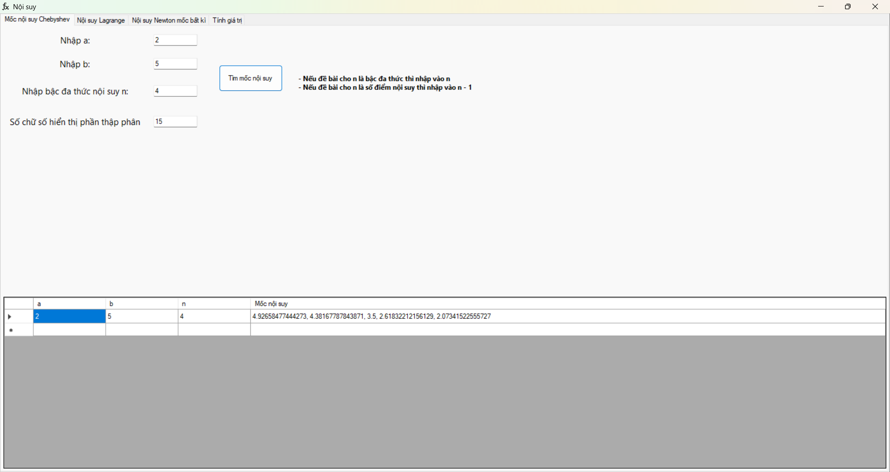
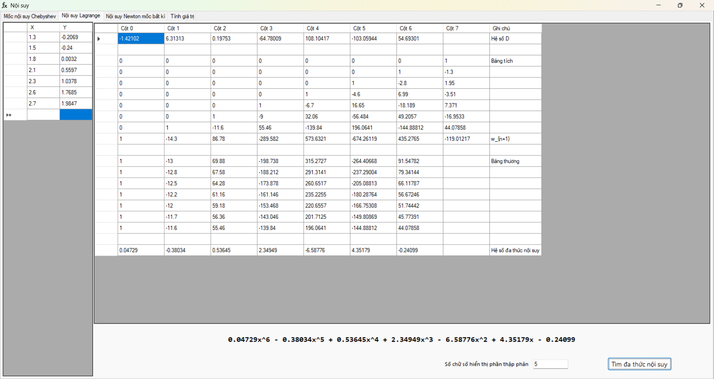
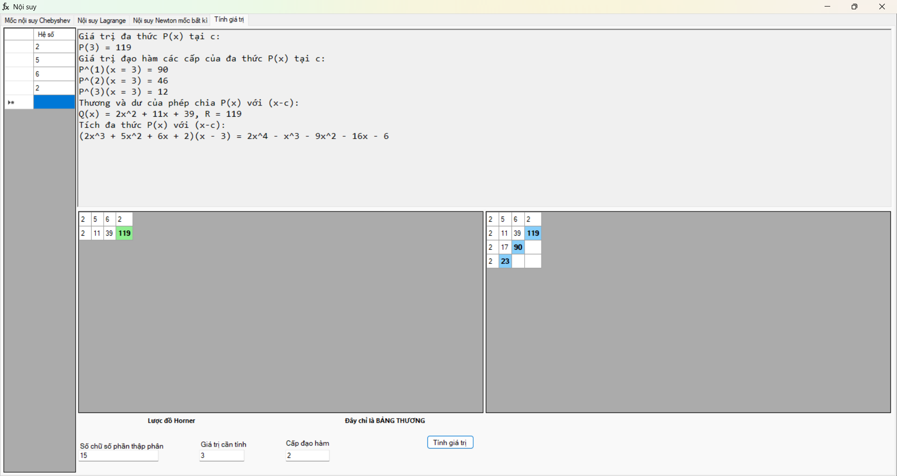

# Phương pháp số - Đa thức nội suy

## Mục đích:
- Thực hiện gần hết các chức năng cần thiết trong chương nội suy môn phương pháp số
- Giúp đỡ mọi người qua học phần Phương pháp số

## Tính năng:
- Hiển thị đầy đủ quá trình tìm đa thức nội suy và sử dụng lược đồ Horner để nhân chia đa thức ...
- Khi phát hiện điểm nội suy trùng nhau, tự động giữ lại điểm đầu tiên và loại bỏ tất cả các điểm đằng sau
- Nếu có góp ý sửa lỗi hãy tạo Issues mới hoặc nếu có ý tưởng cải tiến hãy tạo Pull requests

## WIP
- Nội suy trung tâm
- ...

## Hướng dẫn sử dụng (?)

- Dữ liệu nhập vào gồm: (a, b) và n là bậc của đa thức nội suy (Nếu đề bài cho n là số điểm nội suy thì nhập vào giá trị n - 1)

- Khi nhập vào bộ dữ liệu điểm (x, y) **LUÔN LUÔN** để thừa ra **1 DÒNG** như trong hình

- Khi nhập vào mảng hệ số **LUÔN LUÔN** để thừa ra **1 DÒNG** như trong hình
- Giá trị in đậm trong bảng thương **CHƯA PHẢI** là giá trị cuối cùng của đạo hàm cấp k của P(x = c) người dùng cần phải lấy kết quả in đậm đó nhân với k! (k là đạo hàm cấp cần tính) để ra kết quả cuối cùng
- Giá trị ở màn hình thông báo là giá trị cuối cùng cần tìm

## **Lưu ý khi sử dụng**
- Nếu báo **lỗi định dạng** thì kiểm tra lại dữ liệu nhập vào
- Khi nhập lưu ý dùng dấu **.** để biểu diễn phần thập phân
- **LUÔN LUÔN** để cách 1 dòng khi nhập giá trị

## Tải
- Tải ở Releases hoặc ấn vào [đây](https://github.com/qanhta2710/Interpolation/releases) 

## Contributors
- Cảm ơn bác [TontonYuta](https://github.com/TontonYuta) đã giúp em tạo ý tưởng thực hiện tạo App này.